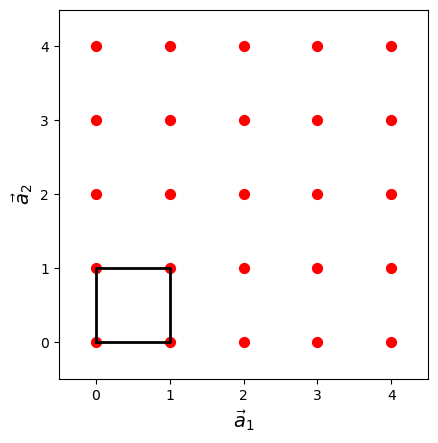

# Lattice models

## lattice

In three dimensions, a lattice can be defined as a regular arrangement of points in three-dimensional space, where each point has identical surroundings and the arrangement repeats itself periodically in all directions. More formally, a lattice in three dimensions can be defined as a set of points of the form $\vec{r} = n_1\vec{a}_1 + n_2\vec{a}_2 + n_3\vec{a}_3$, where $\vec{a}_1$, $\vec{a}_2$, and $\vec{a}_3$ are three linearly independent vectors called the lattice vectors, and $n_1$, $n_2$, and $n_3$ are integers.

The lattice vectors $\vec{a}_1$, $\vec{a}_2$, and $\vec{a}_3$ are chosen such that they form a parallelepiped that contains all the lattice points. This parallelepiped is called the unit cell of the lattice, and it represents the repeating pattern of the lattice.

The figure illustrates a 2d lattice with the unit cell marked out.

There are many types of lattices in three dimensions, each with different symmetry properties. Some common examples include the simple cubic lattice, the face-centered cubic lattice, and the body-centered cubic lattice. The simple cubic lattice is the most basic type of lattice, where each lattice point is at the corner of a cube. The face-centered cubic lattice has additional lattice points at the center of each face of the cube, while the body-centered cubic lattice has an additional lattice point at the center of the cube.

IMPORTANT #1: For systems with disorder (e.g gas and liquids) we make use of a "super lattice" contaning a large number of sites. The repeating unit can be threrfore be very large!

IMPORTANT #2: Neighbors (especially nearest neieghbors = NN ) are important in lattice models. We should explain the concept of periodic boundary conditions here and illustrate this concept in terms of which lattice site are connected (NN).

## Ideal Lattice Gas

The ideal lattice gas model is a simplified representation of a gas system in statistical mechanics. It provides a theoretical framework for studying the behavior of non-interacting particles in a lattice structure. This model serves as a fundamental reference for understanding the properties of real gases under certain conditions.

During the process of adsorption, the gas binds to the surface of the solid through various intermolecular interractions. If these are weak van der waals then physical adsorption is present, if these are strong covalent bonds then we have chemical adsorption. When building the adsorption model of an ideal lattice gas, we are gonna consider the surface of the lattice as having M sites, which will be occupied by N molecules. There are two assumptions that we are going to keep in mind:
(i) The sites M are equivalent and independent 
(ii) There is a maximum of one molecule bonded per site 

So, the partition function for an adsorbed molecule would then be:

$q(T) = q_{x} q_{y} q_{z} e^{-(U_{00}/kT)}$

where q_{X}, q_{y}, and q_{z} are the 1-dimenional harmonic oscillator-type partition functions. Considering that during the process of adsorption the free gas is in equilibrium with the adsorbed molecules. The same zero-level energy for the molecules in the gas and adsorbed state must be present. Hence, let U=0 correspond to the gas molecule at rest for z→∞, then U_{OO} would be the energy at the minimum of U_{O}(x,y). Which would therefore be the potential energy of the adsorbed molecules at 0K, meaning that U_{OO}<0.

Therefore for the two possible situations of :

N = M
$Q(N,M,T) = q(T)^{N}$                                                        ...equation (i)

N ≤ M 
$Q(N,M,T) = (M    N) q(T)^{N}$                                                ...equation(ii)

Where (M N) is a binomial coefficient, representing the number of possible ways that the N indistinguishable molecules can be distributed on the M distinguishable sites. The relationship of which may be expressed as:

$(M  N) = (M!/N!(M-N)!$

Therefore through the stirling approximation we can then have:

$lnQ = MlnM - M - (NlnN - N) - [(M - N)ln(M - N)-(M - N)] + Nlnq$
$lnQ = MlnM - NlnN - (M - N)ln(M - N) + Nlnq$                               ...equation(iii)

### Configurational entropy of an ideal lattice gas

The total entropy has two contributions: $S = S_{config} + S_{vib}$. Which can be seen by combining the general entropy equation $S = U/T = klnQ$ to the previously derived equation (iii). 
Hence, the combinatorial term will be: 

$S_{config} = kln(M   N)$

$S_{config} = k(MlnM - M - (NlnN - N) - [(M - N)ln(M - N) - (M - N)])$
$S_{config} = l(MlnM - NlnN - (M - N)ln(M - N))$

The interaction term will be:

$S_{vib} = Nk(lnq + T(dlnq/dT)$

### Chemical potential - applied to a pure substance
The chemical potential gives an indication of how the Gibbs function changes as the composition of a mixture changes. For the compound "i" in a mixture, the chemical potential, also known as the partial molar Gibbs function, is:

$U_{i} = (δG/δn_{i})_{p,T,n_{i}≠i}$

Since a system would tend to decrease the Gibbs function as much as possible, the chemical potential would point to the direction where this can be achieved. 

For a pure substance, the Gibbs free energy is given by:
$G = n G_{m}$

Where G_{m} is the molar free energy. Hence, the chemical potential for a pure substance would be:

$U_{i} = (δG/δn_{i}) = (δnG_{m}/δn) = G_{m}$

## Interacting Lattice Gas with Nearest-Neighbor Interactions

In the context of statistical mechanics, an interacting lattice gas refers to a model where N particles adhered to M sites of a lattice experience interactions, specifically nearest-neighbor interactions. The energy associated with these interactions is denoted as $w$. The model is once again a one-dimensional lattice gas, so the criteria of equation (ii) can be applied, whereby N≤M. So, denoting the filled sites of the lattice as "1" and the empty sites as "0", for the following exemplary lattice surface adsorption:

1 1 1 0 0 1 0 1 0 0 1 1 0 

We would have a total of 13 sites, M=13, occupied by 7 molecules, N=7. Additionally, we have the following nearest-neighbour interractions:

Therefore, ignoring boundary effects in general we would then have:

$2N = 2N_{11} + N_{01}$

$2(M-N) = 2N_{00} + N_{01}$

As can be noted, we have three unknown variables N_{11}, N_{00} and N_{01}. Therefore, making N_{01} an independent variable, we can derive the total interaction energy;

$2N = 2N_{11} + N_{01}$

$2N_{11} = 2N - N_{01}$

$N_{11} = N - (N_{01}/2)$

$(N_{11})w = (N - (N_{01}/2))w$

If g(N,M,N_{01}) is the number of configurations with N_{01} pairs for a given (N,M), the Canonical partition function for the one dimensional lattice gas can be written as:

$Q(N,M,T) = q^{N}Σg(N,M,N_{01})e^{-(N-N_{01}/2)w/kT}$

$Q(N,M,T) = [(qe^{-w/kT})^{N}][Σg(N,M,N_{01})][(e^{w/2kT)^{N_{01}}]$

where the Σ is over all possible values of N_{01} for given (N,M). 

### Lattice theory of solutions

For a solution consisting of N_{A} and N_{B} molecules, the active sites of the lattice would be occupied as $M = N_{A} + N_{B}$. Considering the pair interactions w_{AA}, w_{AB} and w_{BB}, the Canonical partition function would then be written as:

$Q(N_{A},N_{B},T) = q_{A}^{N_{A}}q_{B}^{N_{B}}Σg(N_{A},N_{AB},M)e^{-W/kT}$

where the Σ is over all possible values of N_{AB}, and $W = N_{AA}w_{AA} + N_{AB}w_{AB} + N_{BB}w_{BB}$. We now define $w = w_{AA} + w_{BB} - 2W_{AB}$ and introduce:

$cN_{A} = 2N_{AA} + N_{AB}$

$cN_{B} = 2N_{BB} + N_{AB}$

together with the expression $x = e^{w/2kT}$, we can get:

$Q = [q_{A}e^{-cw_{AA}/2kT}^{N_A}] [q_{B}e^{-cw_{BB}/2kT}^{N_B}] Σgx^{N_{AB}}$

where the Σ is over all possible values of N_{AB}

### Bragg-Williams approximation (Mean-field approximation)
The Bragg-Williams approximation is a mean-field theory approach. It arises by randomly distributing the molecules over the sites (as if w=0) and then counting the average number of interaction, therefore the N_{11} terms. 

$Q(N,M,T) = (M  N) q^{N} e^{-N_{11-average}w/kT}$                                 ....equation (iv)

Where N_{11-average} is the average number of 11 interractions and N_{11-average}w is the average interaction energy.
For a lattice with c neighbour sites, the average occupied sites of a molecule would be $cθ = cN/M$. (Considering that $θ = N/M$). The average number of 11 interractions would then be:

$N_{11-average} = c(N/M)(N/2) = cN^{2}/2M$                                     ...equation(v)

Taking logarithyms of equation (iv) and substituting in equation (v):

$lnQ = MlnM - NlnN - (M - N)ln(M - N) + Nlnq - cN^{2}w/2MkT$

## Mixing

For a lattice solution of components A and B, the three possible interactions at the lattice sites are AA, BB and AB. Therefore, the total energy of the system would then correspond to these three types of interractions:

$U = m_{AA}w_{AA} + m_{BB}w_{BB} + m_{AB}w_{AB}$

Where m correspond to the number of bonds and w is the contact energy. Instead of expressing the values in terms of m, (which are typically not known), N can be used, corresponding to the number of atoms present. The relationship between the two, for an A particle in contact being:

$zN_{A} = 2m_{AA} + m_{AB}$

(For a homogeneous interraction, there are two of the same points of contact for the A particle in question, and 1 point of contact for an AB bond.)

Similarly for a B particle:

$zN_{B} = 2m_{BB} + m_{AB}$

Therefore, solving the two equations for the m values:

$m_{AA} = (zN_{A} - m_{AB})/2$ 
$m_{BB} = (zN_{B} - m_{AB})/2$ 

Substituting this into the equation for the total energy, we get:

$U = ((zN_{A} - m_{AB})/2)w_{AA} + ((zN_{B} - m_{AB})/2)w_{BB} + m_{AB}w_{AB}$

$U = ((zw_{AA}/2)N_{A}) + ((zw_{BB}/2)N_{B}) + (w_{AB} - (W{AA}+w{BB}/2))m_{AB}$

Now, using the Bragg-Wiliams approximation we may solve for m_{AB}. Generally, different arrangements of the system's particles will influence the outcome of m_{AB}. However, by assuming that the molecules are distributed randomly and uniformly amongst the sites of the lattice, we can carry out a mean filed approximation and estimate m_{AB}. 

Considering a random site, the probability that it is occuped by a B molecule is:

$p_{B} = N_{B}/N = x_{B} = 1-x$

There are z nearest neighbour sites for each molecule of A, therefore, the average number of AB contacts made by that particular molecule of A is zN_{B}/N = z(1-x).

So, $m_{AB} ≈ zN_{A}N_{B}/N = zNx(1-x)$

Having an expression for m_{AB}, we can now determine the total energy U.

$U = ((zw_{AA}/2)N_{A}) + ((zw_{BB}/2)N_{B}) + (w_{AB} - (W{AA}+w{BB}/2))m_{AB}$

$U = ((zw_{AA}/2)N_{A}) + ((zw_{BB}/2)N_{B}) + (w_{AB} - (W{AA}+w{BB}/2))*(zN_{A}N_{B}/N)$

$U = ((zw_{AA}/2)N_{A}) + ((zw_{BB}/2)N_{B}) + (kTχ_{AB})*(N_{A}N_{B}/N)$

Whereby χ_{AB} is a dimensionless quantity known as the exchange parameter:

$χ_{AB} = z/kT(w_{AB} - (W{AA}+w{BB}/2))$

Alternatively, from the Bragg-Wiliams approximation, we can also derive properties for mixing through the partition function. If for a pure model of substance A the partition function is defined as:

$Q(N_{A},T) = (q_{A}(e^{-cw_{AA}/2kT})^{N_{A}})$

For a mixture of A and B randomly occupying the sites of lattice, the partition function expression then becomes:

$Q = (q_{A}e^{cw_{AA}/2kT}^{N_{A}})*(q_{B}e^{cw_{BB}/2kT}^{N_{B}})*[(N_{A}+(N_{B})!x^{N'_{AB}}/N_{A}!{N_{B}!]$

From the Bragg-Williams partition function expression for mixtures, the following mixing properties can then be defined:

$ΔA_{m}/MkT = x_{A}ln(x_{A})+x_{B}ln(x_{B})-(cw/2kT)x_{A}x_{B}$

$ΔS_{m}/Mk = -x_{A}ln(x_{A})-x_{B}ln(x_{B})$

$ΔE_{m}/MkT = -(cw/2kT)x_{A}x_{B}$

Looking at the relationship between the energy of mixing E and w, if w is negative, the energy would be positive. As noted previously wherby we defined $w = w_{AA} + w_{BB} - 2W_{AB}$. When the overall w is negative, therefore w_{AA} + w_{BB} < 2W_{AB}. Meaning that the pairs AA and BB would be more stable than AB. 

### References
1) An intro to statistical thermodynamics - book
2) https://chem.libretexts.org/Courses/Millersville_University/CHEM_341-_Physical_Chemistry_I/07%3A_Mixtures_and_Solutions/7.03%3A_Chemical_Potential
3) http://staff.um.edu.mt/jgri1/teaching/che2372/notes/05/i_chem_pot.html

